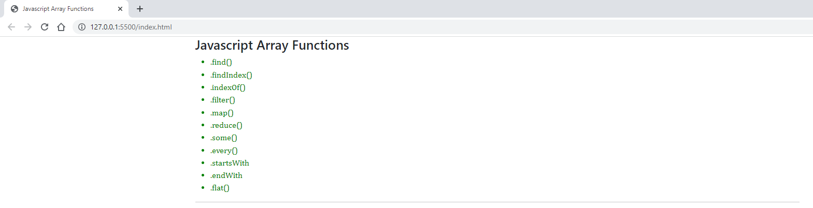

# Javascript Array Functions
The features of javascript in this repository;
- .find() 
- .findIndex() 
- .indexOf() 
- .filter() 
- .map() 
- .reduce() 
- .some() 
- .every() 
- .startsWith 
- .endWith 
- .flat() 
usage is explained.

